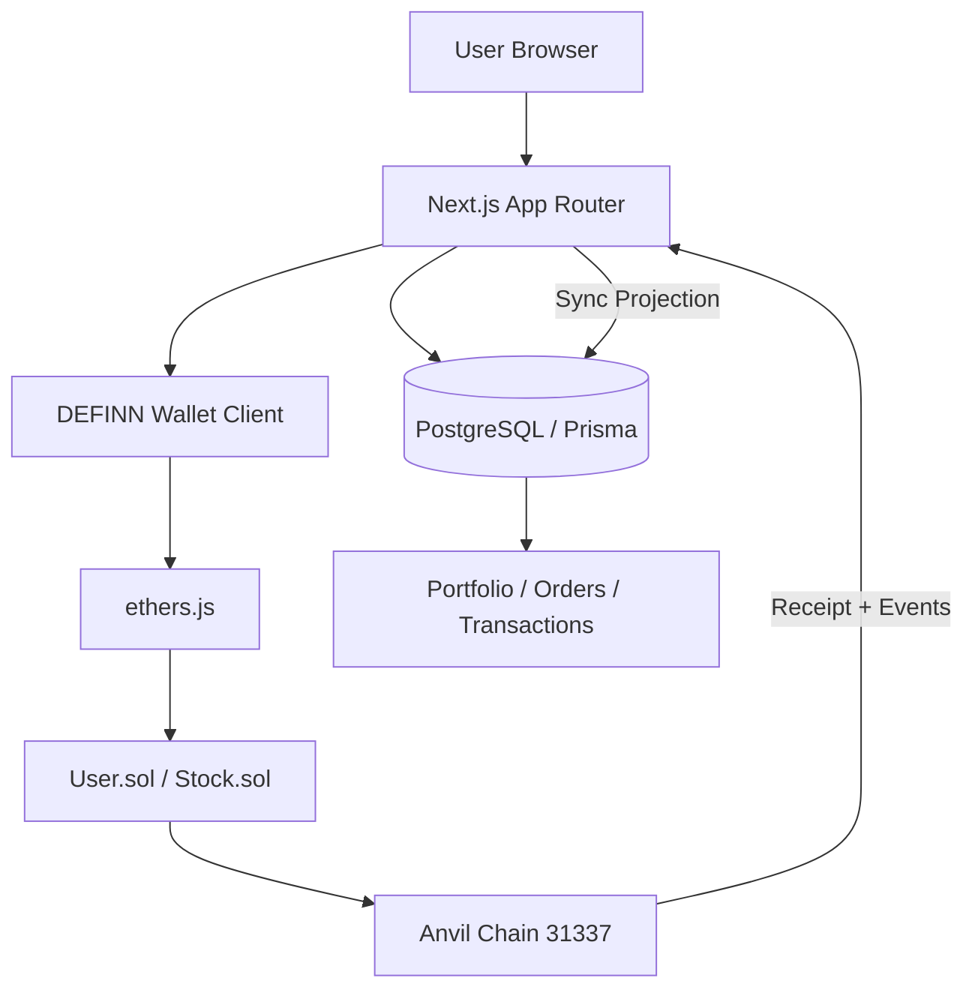
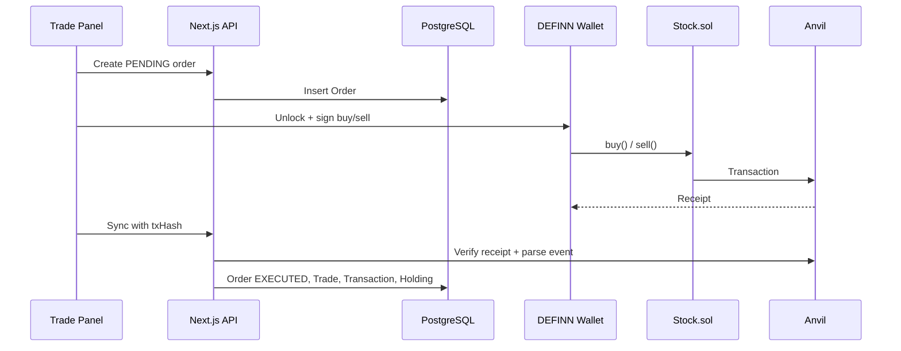
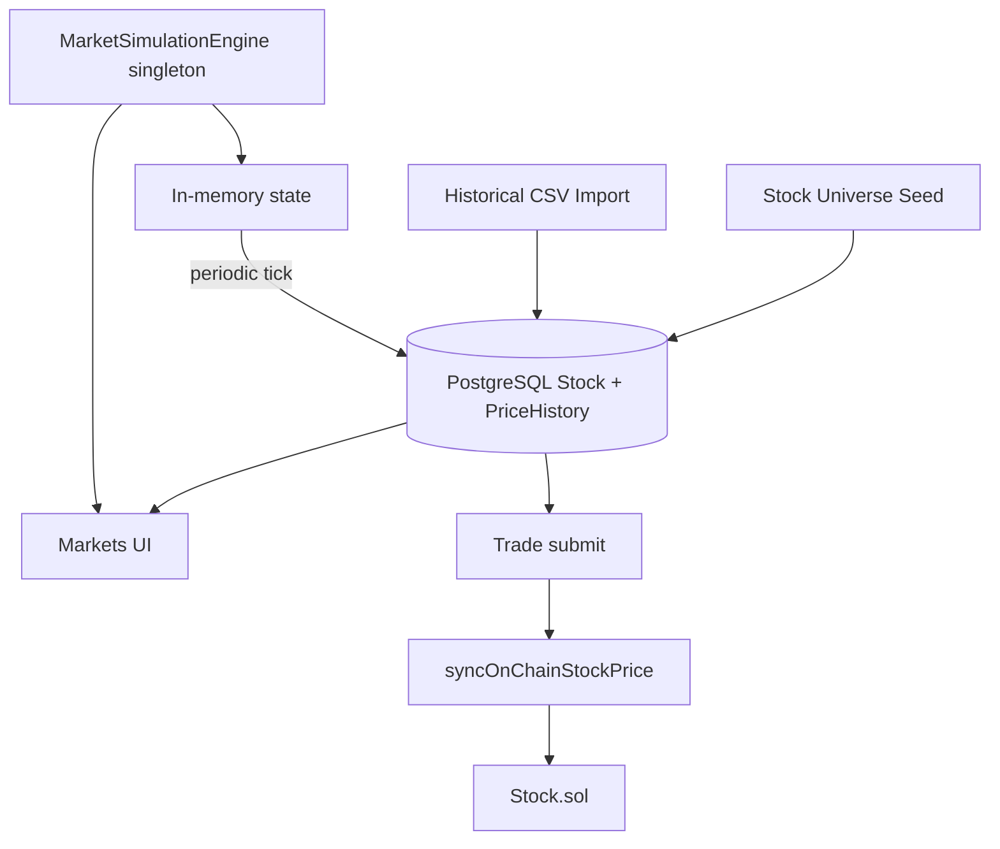
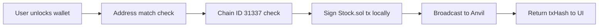
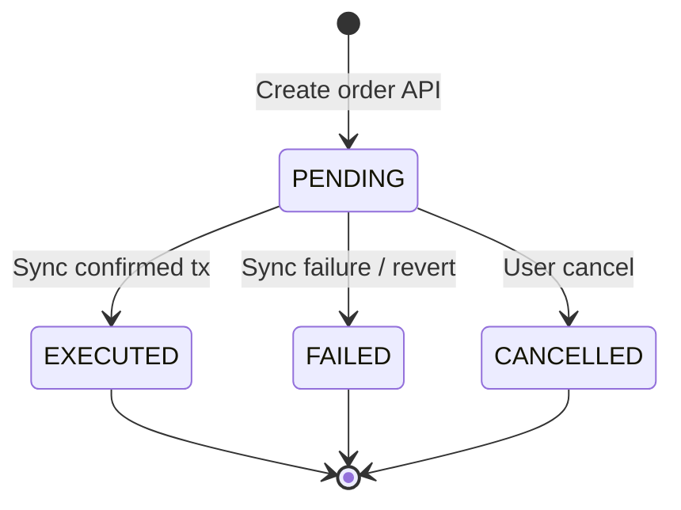

# DEFINN Architecture

DEFINN is an **academic blockchain stock-trading simulation**. It combines a Next.js application, PostgreSQL, a custom client-side wallet, and Solidity smart contracts on local Anvil (chain ID 31337).

## High-level architecture

| Layer | Technology | Role |
| --- | --- | --- |
| UI | Next.js 16, React 19, Tailwind, shadcn/ui, Recharts | Dashboard, markets, trading, portfolio, explorer |
| API | Next.js routes + Server Actions | Auth, trading sync, portfolio, transactions |
| Database | PostgreSQL 17, Prisma 7 | Users, market cache, orders, holdings, transaction projection |
| Wallet | Custom DEFINN Wallet (ethers.js) | Client-side signing, encrypted keystore |
| Blockchain | Anvil, Solidity 0.8.24, Foundry | Simulated execution truth for trades, cash, holdings |

## Trading flow

**Source of truth:** `Stock.sol` for execution price, virtual cash, and on-chain holdings. PostgreSQL simulated prices are for **browse/valuation**; on-chain price is synced at trade submit time via the admin oracle.

## Market simulation (Phase 16)

- **Historical data:** CSV import only — no NSE/BSE scraping
- **Future prices:** DEFINN stochastic engine (`HISTORICAL` vs `SIMULATED` in `PriceHistory`)
- **Blockchain:** price snapshot updated on trade, not every simulation tick

## Wallet signing flow

Private keys and mnemonics **never** leave the browser. The server stores only wallet **address metadata**.

## Transaction lifecycle

Sync is **idempotent** by unique `txHash`. Historical PostgreSQL records are preserved if Anvil is reset (stale-chain safety).

## Security boundaries

- **Authentication:** Auth.js v5, Argon2id, JWT sessions
- **Authorization:** All user-owned APIs scoped by session `userId`
- **Wallet:** Client-side keystore; address match before signing
- **Errors:** Safe client messages (Phase 14 hardening)

See [security.md](./security.md) and [security-audit.md](./security-audit.md).

## Development assumptions

- Local PostgreSQL and Anvil only
- Chain ID **31337**
- Anvil default dev keys — never for real funds
- Not production-ready
